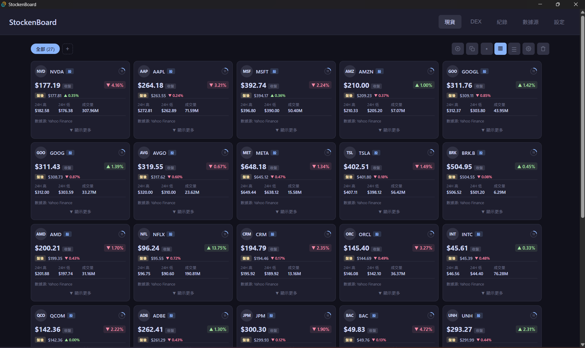
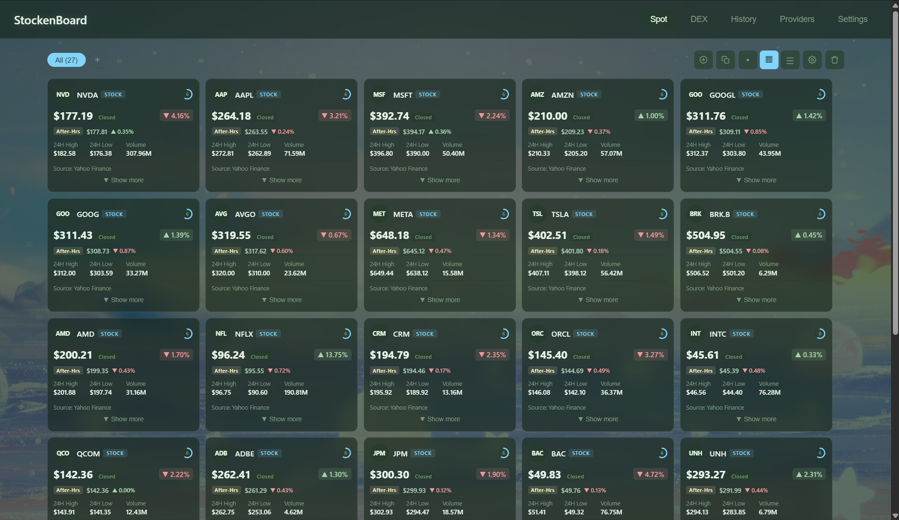
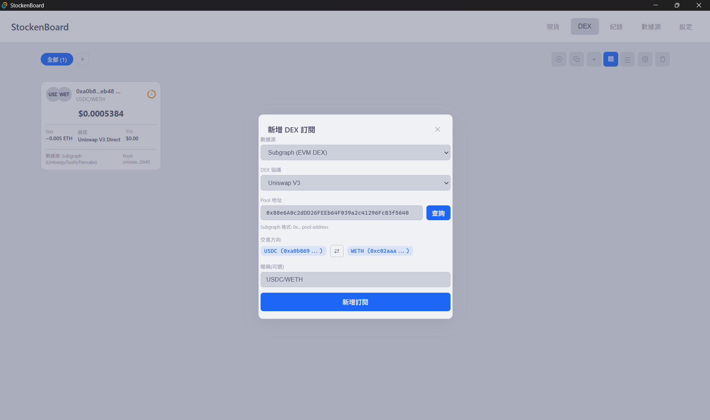
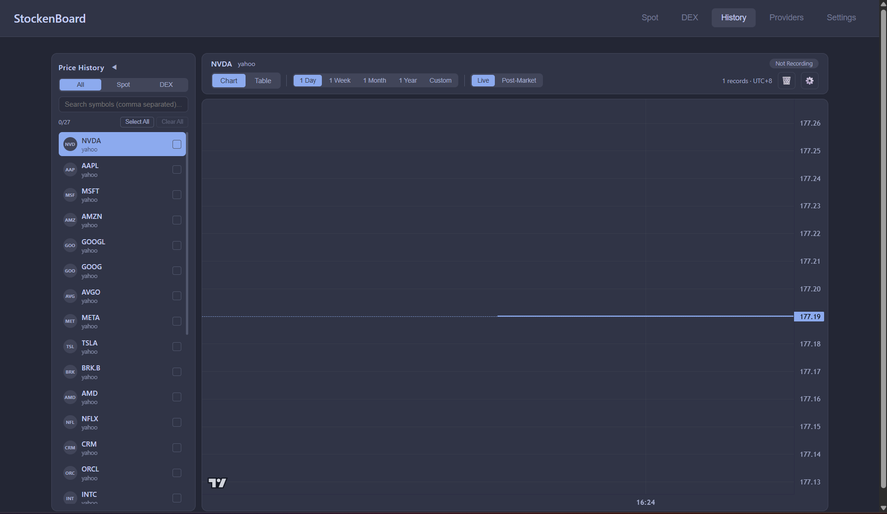
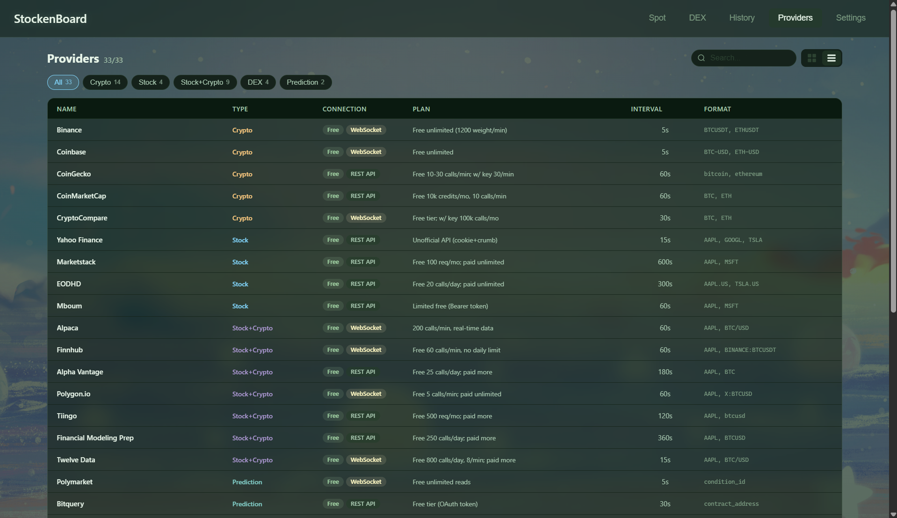
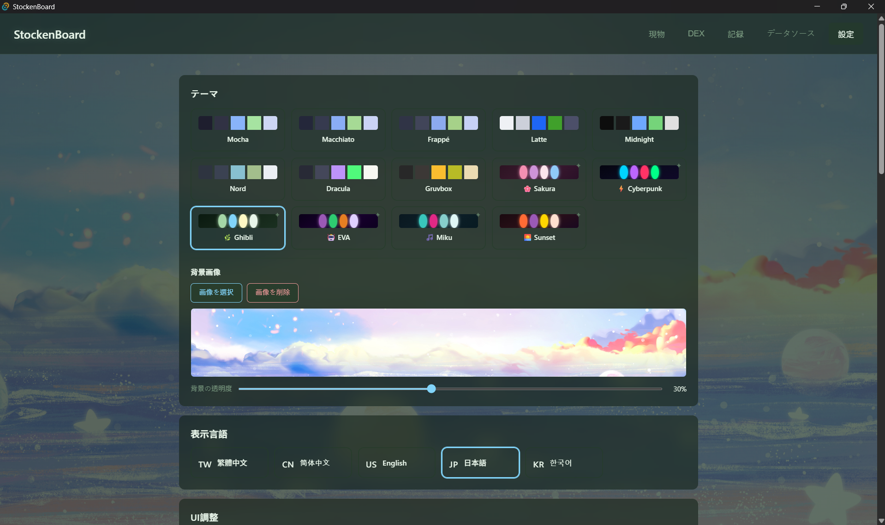

# StockenBoard

<div align="center">

**即時股票與加密貨幣看板**

支援 33 個數據源 | 多頁面管理 | HTTP API | 歷史數據記錄

[](LICENSE)
[](https://github.com/yourusername/stockenboard/actions/workflows/release.yml)
[](https://tauri.app/)
[](https://react.dev/)
[](https://www.rust-lang.org/)

[English](README.en.md) | 繁體中文 | [简体中文](README.zh-CN.md) | [日本語](README.ja.md) | [한국어](README.ko.md)

</div>

---

## ✨ 功能特色

### 📊 數據源支援（33 個）

<details>
<summary><b>加密貨幣交易所（10 個）</b></summary>

- Binance、Coinbase、Kraken、Bybit、KuCoin
- OKX、Gate.io、Bitfinex、HTX、MEXC

</details>

<details>
<summary><b>加密貨幣聚合器（4 個）</b></summary>

- CoinGecko、CoinMarketCap、CoinPaprika、CryptoCompare

</details>

<details>
<summary><b>股票 / 多資產（12 個）</b></summary>

- Yahoo Finance、Finnhub、Alpha Vantage、Polygon
- Twelve Data、Alpaca、Tiingo、FMP
- Marketstack、EODHD、Mboum、FCS API

</details>

<details>
<summary><b>DEX 聚合器（4 個）</b></summary>

- Jupiter（Solana）
- OKX DEX（多鏈）
- Raydium（Solana）
- Subgraph（Uniswap/Sushi/Pancake）

</details>

<details>
<summary><b>預測市場（2 個）</b></summary>

- Polymarket、Bitquery

</details>

<details>
<summary><b>多資產聚合器（1 個）</b></summary>

- CoinAPI

</details>

### 🎯 核心功能

- ⚡ **即時價格追蹤** - REST + WebSocket 雙模式
- 🔌 **HTTP API** - 供 AI 或外部程式訪問（可配置端口）
- 📈 **歷史數據記錄** - 自動記錄價格變化，支援圖表分析
- 🎨 **多視圖模式** - Grid / List / Compact 三種顯示方式
- 📁 **自訂頁面** - 建立多個頁面分類管理訂閱
- 🔄 **批量操作** - 批量新增、刪除、匯出、匯入訂閱
- 🎭 **自訂外觀** - 14 種主題、自訂圖示、背景圖片
- 🌍 **多語言** - 繁中、簡中、英文、日文、韓文
- 🔔 **推播通知** - 條件觸發式通知，支援 Telegram Bot 及 Webhook

### 🏗️ 技術架構

- **後端統一 Polling** - Rust 端定時 fetch，前端零 setInterval
- **細粒度訂閱** - 每張卡片只在自己的價格變化時 re-render
- **頁面感知** - 只為可見訂閱發送 API 請求，節省資源
- **單例資料庫** - 全局共享 SQLite 連接，避免鎖定問題

---

## 🚀 快速開始

### 安裝

從 [Releases](https://github.com/yourusername/StockenBoard/releases) 下載最新版本。

### 開發

```bash
# 安裝依賴
npm install

# 啟動開發模式
npm run tauri dev

# 建置
npm run tauri build
```

---

## 🔌 HTTP API

StockenBoard 提供 HTTP API 讓外部程式（如 AI、Python 腳本）訪問數據。

### 端點

| 端點 | 說明 |
|------|------|
| `GET /api/status` | 系統狀態 |
| `GET /api/subscriptions` | 所有訂閱列表 |
| `GET /api/prices` | 所有最新價格 |
| `GET /api/prices/{provider}/{symbol}` | 特定價格 |
| `GET /api/history` | 歷史數據查詢 |

### 快速範例

```python
import requests

# 獲取所有價格
prices = requests.get("http://localhost:8080/api/prices").json()
for p in prices['prices']:
    print(f"{p['symbol']}: ${p['price']}")

# 獲取歷史數據
history = requests.get("http://localhost:8080/api/history", params={
    "symbol": "BTCUSDT",
    "provider": "binance",
    "limit": 1000
}).json()
```

> 💡 **提示**：API 端口可在應用程式內的「設定 → API 使用說明」中修改。詳細文檔和更多範例請參考該頁面。

---

## 🛠️ 技術棧

| 類別 | 技術 |
|------|------|
| **前端** | React 19 + TypeScript 5.8 + Vite 7 |
| **後端** | Tauri 2 + Rust 1.93 |
| **資料庫** | SQLite (tauri-plugin-sql) |
| **API** | Axum 0.7 + Tower |
| **圖表** | lightweight-charts 5.1 |
| **主題** | Catppuccin Mocha |

---

## 📦 專案結構

```
StockenBoard/
├── src/                    # 前端代碼
│   ├── components/         # React 組件
│   ├── hooks/              # 自訂 Hooks
│   ├── lib/                # 工具函數和 i18n
│   └── types/              # TypeScript 類型定義
├── src-tauri/              # 後端代碼
│   └── src/
│       ├── providers/      # 33 個數據源實現
│       ├── api_server.rs   # HTTP API Server
│       ├── polling.rs      # 統一 Polling 管理
│       ├── commands.rs     # Tauri Commands
│       └── db.rs           # 資料庫 Schema
├── test_api.py             # API 測試腳本
└── example_ai_usage.py     # AI 使用範例
```

---

## 🎨 截圖

### 主頁面 - Grid 視圖


### 主頁面 - List 視圖


### DEX 頁面


### 歷史記錄與圖表


### 數據源設定


### 設定頁面


---

## 📝 授權

本專案採用 [MIT License](LICENSE) 授權。

---

## ⚠️ 免責聲明

本軟體提供的所有市場數據僅供參考，不構成任何投資建議。數據可能存在延遲、不準確或不完整的情況。使用者應自行判斷並承擔所有投資風險。

All market data provided by this software is for informational purposes only and does not constitute investment advice. Data may be delayed, inaccurate, or incomplete. Users should exercise their own judgment and assume all investment risks.

---

<div align="center">

**[⭐ Star this project](https://github.com/yourusername/StockenBoard)** if you find it useful!

Made with ❤️ using Tauri + React + Rust

</div>
