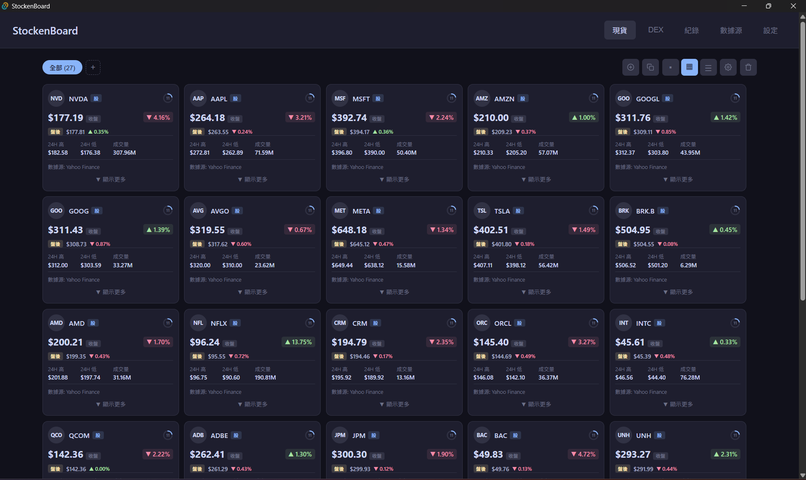
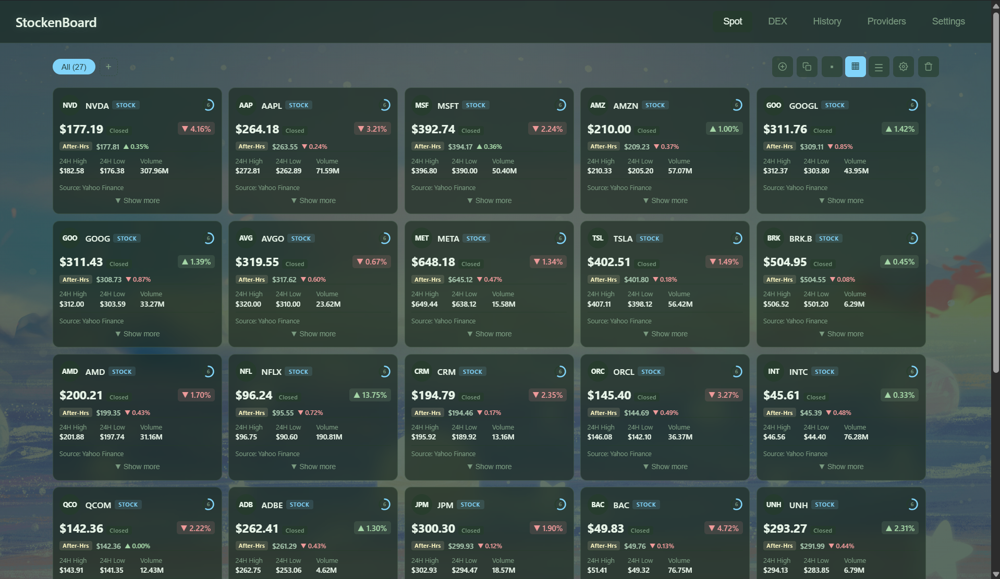
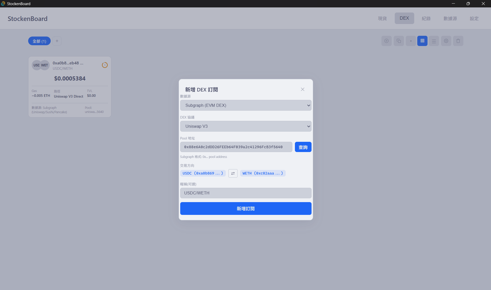
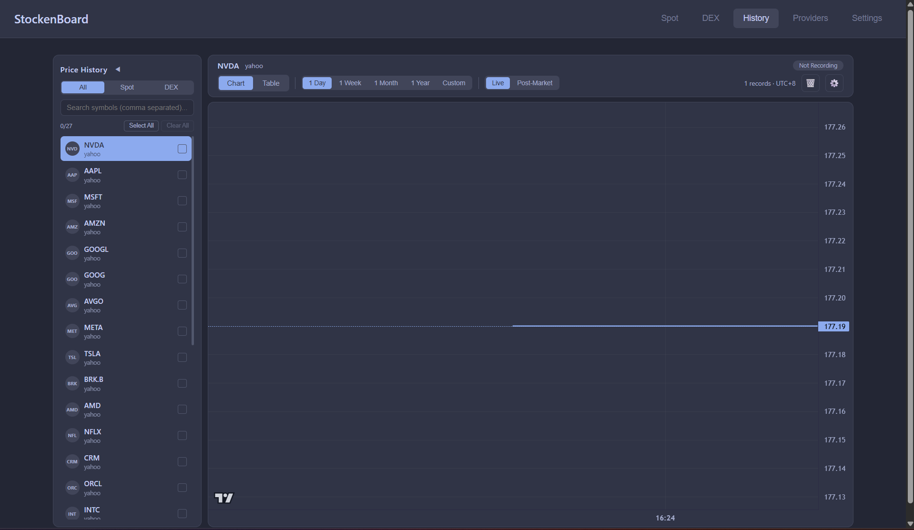
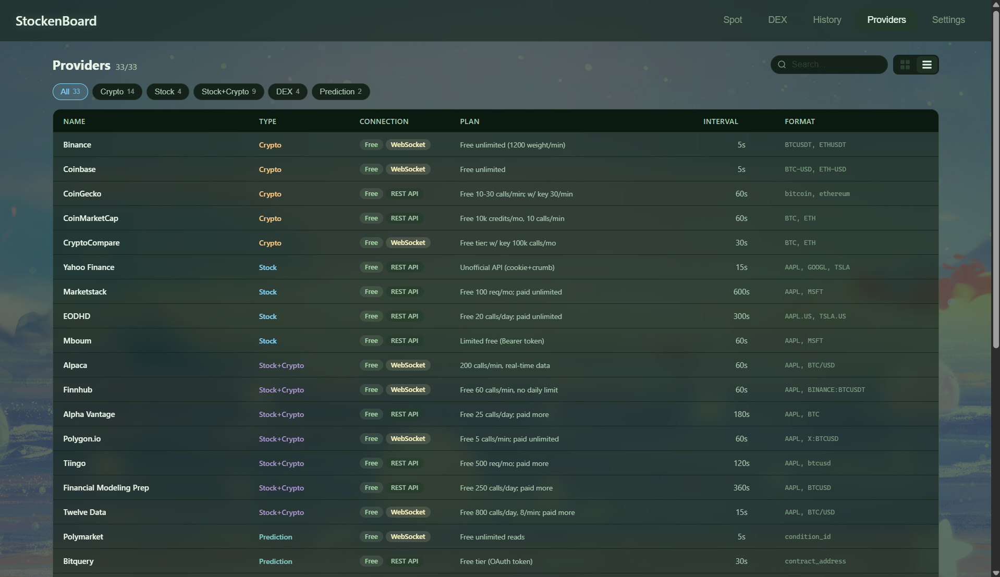
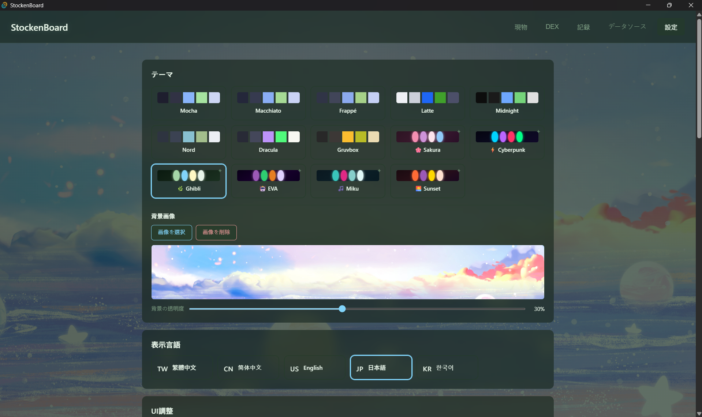

# StockenBoard

<div align="center">

**实时股票与加密货币看板**

支持 33 个数据源 | 多页面管理 | HTTP API | 历史数据记录

[](LICENSE)
[](https://github.com/yourusername/stockenboard/actions/workflows/release.yml)
[](https://tauri.app/)
[](https://react.dev/)
[](https://www.rust-lang.org/)

[English](README.en.md) | [繁體中文](README.md) | 简体中文 | [日本語](README.ja.md) | [한국어](README.ko.md)

</div>

---

## ✨ 功能特色

### 📊 数据源支持（33 个）

<details>
<summary><b>加密货币交易所（10 个）</b></summary>

- Binance、Coinbase、Kraken、Bybit、KuCoin
- OKX、Gate.io、Bitfinex、HTX、MEXC

</details>

<details>
<summary><b>加密货币聚合器（4 个）</b></summary>

- CoinGecko、CoinMarketCap、CoinPaprika、CryptoCompare

</details>

<details>
<summary><b>股票 / 多资产（12 个）</b></summary>

- Yahoo Finance、Finnhub、Alpha Vantage、Polygon
- Twelve Data、Alpaca、Tiingo、FMP
- Marketstack、EODHD、Mboum、FCS API

</details>

<details>
<summary><b>DEX 聚合器（4 个）</b></summary>

- Jupiter（Solana）
- OKX DEX（多链）
- Raydium（Solana）
- Subgraph（Uniswap/Sushi/Pancake）

</details>

<details>
<summary><b>预测市场（2 个）</b></summary>

- Polymarket、Bitquery

</details>

<details>
<summary><b>多资产聚合器（1 个）</b></summary>

- CoinAPI

</details>

### 🎯 核心功能

- ⚡ **实时价格追踪** - REST + WebSocket 双模式
- 🔌 **HTTP API** - 供 AI 或外部程序访问（可配置端口）
- 📈 **历史数据记录** - 自动记录价格变化，支持图表分析
- 🎨 **多视图模式** - Grid / List / Compact 三种显示方式
- 📁 **自定义页面** - 创建多个页面分类管理订阅
- 🔄 **批量操作** - 批量新增、删除、导出、导入订阅
- 🎭 **自定义外观** - 14 种主题、自定义图标、背景图片
- 🌍 **多语言** - 繁中、简中、英文、日文、韩文

### 🏗️ 技术架构

- **后端统一 Polling** - Rust 端定时 fetch，前端零 setInterval
- **细粒度订阅** - 每张卡片只在自己的价格变化时 re-render
- **页面感知** - 只为可见订阅发送 API 请求，节省资源
- **单例数据库** - 全局共享 SQLite 连接，避免锁定问题

---

## 🚀 快速开始

### 安装

从 [Releases](https://github.com/yourusername/StockenBoard/releases) 下载最新版本。

### 开发

```bash
# 安装依赖
npm install

# 启动开发模式
npm run tauri dev

# 构建
npm run tauri build
```

---

## 🔌 HTTP API

StockenBoard 提供 HTTP API 让外部程序（如 AI、Python 脚本）访问数据。

### 端点

| 端点 | 说明 |
|------|------|
| `GET /api/status` | 系统状态 |
| `GET /api/subscriptions` | 所有订阅列表 |
| `GET /api/prices` | 所有最新价格 |
| `GET /api/prices/{provider}/{symbol}` | 特定价格 |
| `GET /api/history` | 历史数据查询 |

### 快速示例

```python
import requests

# 获取所有价格
prices = requests.get("http://localhost:8080/api/prices").json()
for p in prices['prices']:
    print(f"{p['symbol']}: ${p['price']}")

# 获取历史数据
history = requests.get("http://localhost:8080/api/history", params={
    "symbol": "BTCUSDT",
    "provider": "binance",
    "limit": 1000
}).json()
```

> 💡 **提示**：API 端口可在应用程序内的「设置 → API 使用说明」中修改。详细文档和更多示例请参考该页面。

---

## 🛠️ 技术栈

| 类别 | 技术 |
|------|------|
| **前端** | React 19 + TypeScript 5.8 + Vite 7 |
| **后端** | Tauri 2 + Rust 1.93 |
| **数据库** | SQLite (tauri-plugin-sql) |
| **API** | Axum 0.7 + Tower |
| **图表** | lightweight-charts 5.1 |
| **主题** | Catppuccin Mocha |

---

## 📦 项目结构

```
StockenBoard/
├── src/                    # 前端代码
│   ├── components/         # React 组件
│   ├── hooks/              # 自定义 Hooks
│   ├── lib/                # 工具函数和 i18n
│   └── types/              # TypeScript 类型定义
├── src-tauri/              # 后端代码
│   └── src/
│       ├── providers/      # 33 个数据源实现
│       ├── api_server.rs   # HTTP API Server
│       ├── polling.rs      # 统一 Polling 管理
│       ├── commands.rs     # Tauri Commands
│       └── db.rs           # 数据库 Schema
├── test_api.py             # API 测试脚本
└── example_ai_usage.py     # AI 使用示例
```

---

## 🎨 截图

### 主页面 - Grid 视图


### 主页面 - List 视图


### DEX 页面


### 历史记录与图表


### 数据源设置


### 设置页面


---

## 📝 授权

本项目采用 [MIT License](LICENSE) 授权。

---

## ⚠️ 免责声明

本软件提供的所有市场数据仅供参考，不构成任何投资建议。数据可能存在延迟、不准确或不完整的情况。使用者应自行判断并承担所有投资风险。

All market data provided by this software is for informational purposes only and does not constitute investment advice. Data may be delayed, inaccurate, or incomplete. Users should exercise their own judgment and assume all investment risks.

---

<div align="center">

**[⭐ Star this project](https://github.com/yourusername/StockenBoard)** if you find it useful!

Made with ❤️ using Tauri + React + Rust

</div>
